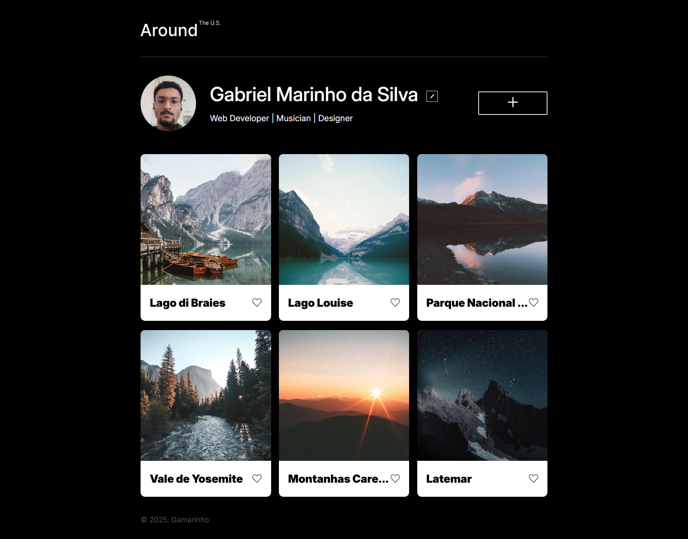

# Around The U.S. - Tripleten


Link: <a href="https://gamarinhos.github.io/web_project_around">Around The U.S.</a>

## Descrição do Projeto

> [!WARNING]
> Utilize navegadores baseados em Chromium para desfrutar da compatibilidade com todas as propriedades CSS utilizadas.

Uma galeria de fotos interativa que exibe os locais visitados adicionados pelo usuário, com uma imagem e um título. O objetivo é criar uma forma dinâmica e visualmente atraente de compartilhar experiências.

## Tecnologias Utilizadas

**Linguagens de programação:**

- HTML5
- CSS3
- JavaScript

**Práticas e arquiteturas:**

- Arquitetura modular
- BEM (CSS)
- Vendor prefixes (CSS) - Autoprefixer: v10.4.7
- OOP (JavaScript)
- Design concepts

## Planos de Melhoria

### Features

1. **Carregar avatar**: Permitir que o usuário carregue uma imagem local para definir o avatar.

2. **Descrição do card**: Dar ao usuário a opção de adicionar mais informações aos cards como uma descrição.

3. **Sticky header**: Manter a seção do perfil fixada no topo da tela enquanto o usuário rola pelos cards.

## Estrutura de arquivos do Projeto

```
.
├── index.html                  # Página principal do site
├── README.md                   # Documentação do projeto
├── favicon.ico                 # Favicon da página
├── pages/
│   ├── index.css               # Estilização da página inicial
│   └── index.js                # Scripts da página inicial
├── blocks/
│   └── ...                     # Estilos para os blocos CSS
├── vendor/
│   ├── normalize.css           # Reset de estilos padrão dos navegadores
│   ├── fonts.css               # Importação e definição de fontes personalizadas
│   └── fonts/
│       └── ...                 # Arquivos de fontes personalizadas
├── utils/
│   ├── constants.js            # Arquivo para constantes globais do projeto
│   └── utils.js                # Funções utilitárias e helpers reutilizáveis
├── components/
│   └── ...                     # Componentes reutilizáveis
└── images/
    ├── screencapture.png       # Captura da página inicial para desktop
    ├── icons.csv               # Sprite dos ícones SVG
    └── ...                     # Outras imagens
```

**Descrição das Pastas:**

- `pages/`: Contém arquivos principais de estilos e scripts de JavaScript específicos das páginas.
- `blocks/`: Reúne arquivos CSS organizados por blocos/componentes seguindo a metodologia BEM.
- `vendor/`: Inclui arquivos de terceiros ou dependências externas (ex: normalização de CSS, fontes).
- `fonts/`: Aarquivos de fontes personalizadas.
- `utils/`: Guarda utilitários, helpers e constantes usadas em todo o projeto.
- `components/`: Contém componentes reutilizáveis e independentes da interface, elementos UI que podem ser empregados em diferentes partes do projeto.
- `images/`: Armazena imagens utilizadas no site, como logos, capturas de tela e ícones.
